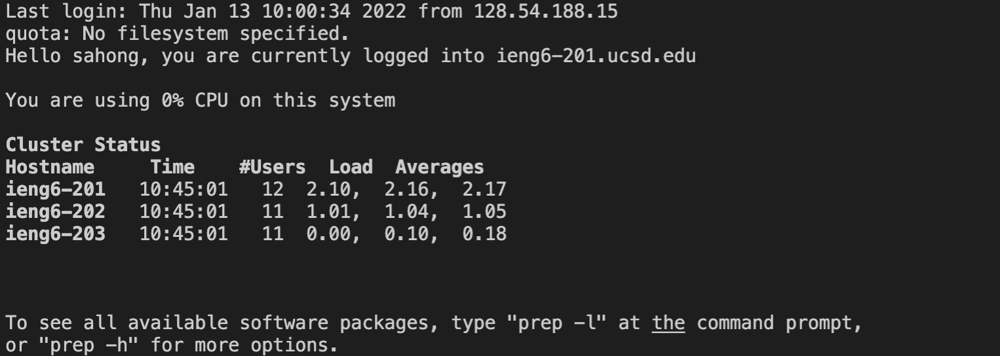

# **WEEK 2 LAB REPORT**

## Installing VSCode
* Firstly, we go to this [website](https://code.visualstudio.com/) to install Visual Studio Code onto our computer

* After installing Visual Studio Code, you should be able to open it and see something like the image below: 

## Remotely Connecting
* Unless you are on Windows, which in that case you will need to download OpenSSH (instructions found on this [link](https://docs.microsoft.com/en-us/windows-server/administration/openssh/openssh_install_firstuse)), you find your login information [here](https://sdacs.ucsd.edu/~icc/index.php)

* In order to connect to the remote computer, we type in the following commands into the terminal in VSCode (where the zz is replaced with their login info): 
> ssh cs15lwi22zz@ieng6.ucsd.edu

* Once you login with the email and enter your password, you will be connected to the computer in the CSE basement when you see output similar to the one shown below: 

## Trying Some Commands

* Try running commands on your computer and the remote computer (through the ssh) such as the ones below:
```
cd~
cd
ls
ls -lat
ls -a
ls<directory>
```

* Some commands might give you an error but this is okay (it can be an access problem). You can run some of the above commands like in the below:


* To log out, use the `exit` command

## Moving Files with scp

* The `scp` commands helps you copy a file from your computer to the remote computer. We implement it as follows: <br>


* We then log in using ssh again, using `ls`. You should see the file in your home directory. Everybody should be able to access and run it since java is downloaded in all the computers.

## Setting an SSH Keys

* `ssh-keygen` keys can help prevent us from having to login every time we want to edit a file. This creates a pair of public and private keys.

* After entering the keys the artwork might look something like the thing below:

<br>

* This creats two new files, the private key (in a file id_rsa) and the public key (in a file id_rsa.pub). We copy the public key to the .ssh directory of your user account on the server in order to access it without typing your password every time.

## Optimizing Remote Running

* You can try to use what we have learned so far by making local edits to a file by copying it to the remote server and then running it.

* Below is one example of code you can use:<br>


