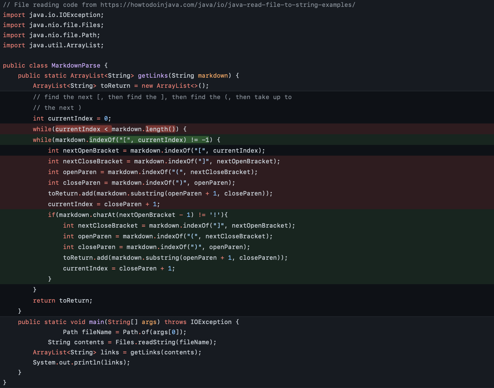
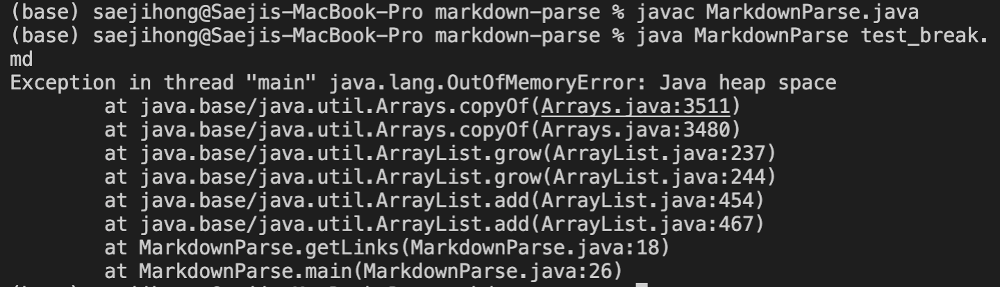
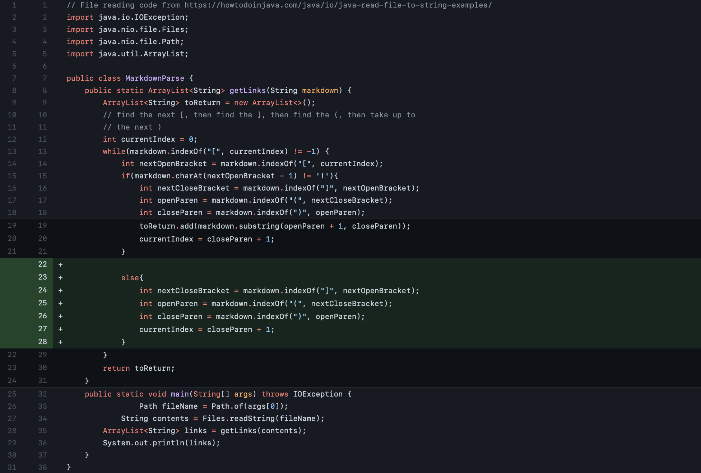
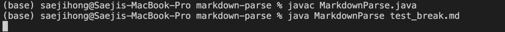
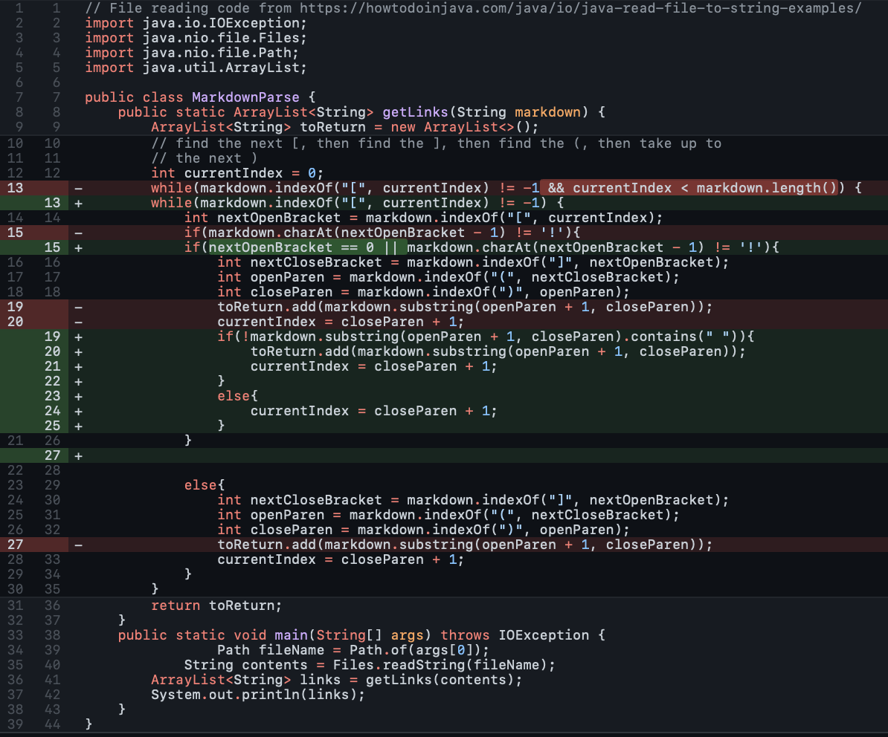
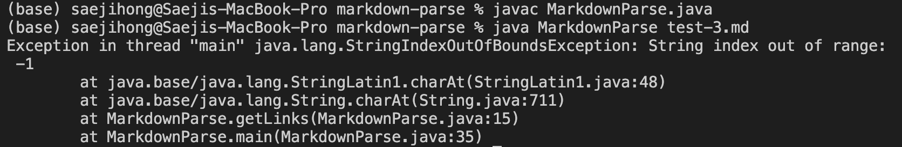

# **WEEK 4 LAB REPORT**

## Example 1 Code Changes



The original file can be seen in this [link](MarkdownParse.java). Although this code seems to work for a tester file such as one with the contents of below:
```
# Title

[a link!](https://something.com)
[another link!](some-page.html)
```

it seems to break when there are other characters in the file. For example, a .md file with the other following contents which can be found in this [file](https://raw.githubusercontent.com/ucsd-cse15l-w22/markdown-parse/main/test-file2.md):
```
# Title

[a link!](https://something.com)
[another link!](some-page.html)

some paragraph text after the links
```

will trigger errors and an infinite loop to the java code linked above as shown below:



Let's address this problem. From the previous example, we see that the code fails because of the value of `currentIndex` which is changed on line 19. Because the `currentIndex` charater is not a `[`, the code goes through the while loop infinitely. We want to fix this by having an `if` statement that accounts for this case that there other extraneous characters.

In summary:
* the **bug** was line 19 which didn't consider the fact to alter the `currentIndex` even if the characters were not found
* the **symptom** was an infinite loop which caused an out of memory error
* the **failure-inducing input** was any characters not part of the links
<br>
<br>
<br>


## Example 2 Code Changes



The original file can be seen in this [link](MarkdownParseChange.java). Although this code seems to work for a tester file such as one with the contents of below:
```
# Title

[a link!](https://something.com)!
[another link!](some-page.html)abc
```

it seems to break when there are image links to the file. For example, a .md file with the other following contents seen in this [file](https://raw.githubusercontent.com/ucsd-cse15l-w22/markdown-parse/main/test-file6.md):

```
# title 


```

will trigger errors and an infinite loop to the java code linked above as shown below:



The error is on line 15, the case in the `if` statement that says the character before the brackets is not an `!`. It is causing the program to run an infinite loop while being stuck on the same `currentIndex`. This is causing the program to crash. The simple fix was to make an extra `else` statement that took out the image links.

In summary:
* the **bug** was line 15 which didn't consider the possibility of images
* the **symptom** was an infinite loop which caused an out of memory error
* the **failure-inducing input** was any links to images
<br>
<br>
<br>

## Example 3 Code Changes



The original file can be seen in this [link](MarkdownParseFinal.java). Although this code seems to work for a tester file such as one with the contents of below:

```
[a link!](google.com)!
[another link!](some-page.html)793
hugs 
```

it seems to break when there are other characters in the file. For example, a .md file with the other following contents which can be found in this [file](https://tylereriksen.github.io/cse15l-lab-reports/index3.html)
```
[](a link on the first line)
```

will trigger errors and an infinite loop to the java code linked above as shown below:



This problem is triggered by line 13 since the original `nextOpenBracket` had index value of 0 so when the if statement compared the previous character, which would make it of value index -1, it was not able to do so since it was out of bounds. Even if we fixed this, the issue was that even though the characters inside the open and close parenthesis was not a link, it was inputted into the return output, triggered by line 20. We want to fix this by fixing the `if` statement that accounts for case `nextOpenBracket` equal to 0 and considers when a text inside the parethesis is not a link.

In summary:
* the **bug** was line 13 and 20 which didn't consider the fact when `nextOpenBracket` = 0 and when text in parethsis was not a link
* the **symptom** was an `StringIndexOutOfBoundsException` and an unwanted string being inputted into the output
* the **failure-inducing input** was any file that had a opening bracket in the beginning and had non-link text with spaces
