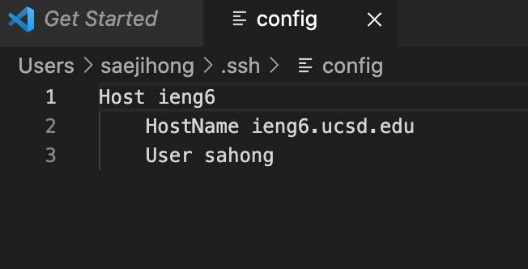

# **WEEK 6 LAB REPORT**

## `.ssh/config` File



I created this file in VisualStudioCode locally and then moved it to the .ssh folder. In there, I editted to say the following: 
```
Host ieng6
    HostName ieng6.ucsd.edu
    User sahong
```

## `ssh` Command Login


I was able to successfully login using just the alias my account. As shown I did not have to write out the entire command below: 
`ssh sahong@ieng6.ucsd.edu`


## `scp` Command Copy


The file I copied that has the following contents: 
```
public class Hello{

    public static void main(String[] args){
        System.out.println("Hello");
    }

}
```
As shown in the screenshot, I was able to use the `scp` command with just typing out the alias I have used above.