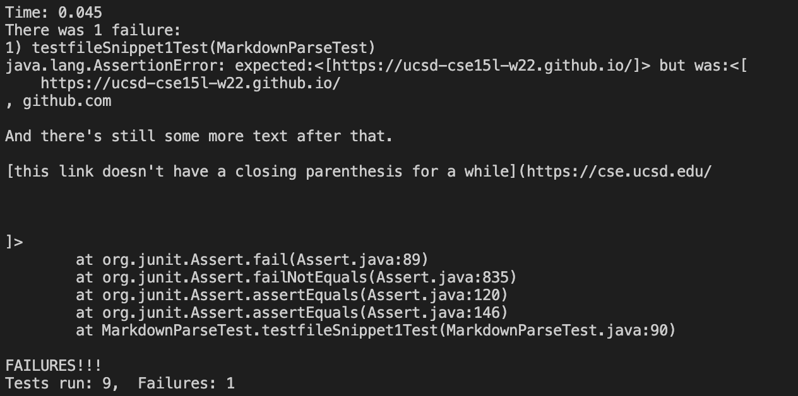

# **WEEK 8 LAB REPORT**

## **THE SNIPPET FILE CONTENT**
### *Snippet 1*
```
`[a link`](url.com)

[another link](`google.com)`

[`cod[e`](google.com)

[`code]`](ucsd.edu)
```
<br>

### *Snippet 2*
```
[a [nested link](a.com)](b.com)

[a nested parenthesized url](a.com(()))

[some escaped \[ brackets \]](example.com)
```
<br>

### *Snippet 3*
```
[this title text is really long and takes up more than 
one line

and has some line breaks](
    https://www.twitter.com
)

[this title text is really long and takes up more than 
one line](
    https://ucsd-cse15l-w22.github.io/
)


[this link doesn't have a closing parenthesis](github.com

And there's still some more text after that.

[this link doesn't have a closing parenthesis for a while](https://cse.ucsd.edu/


)

And then there's more text
```
<br>

## **LINKS**
[My Repository](https://github.com/tylereriksen/markdown-parse.git) <br>
[Reviewed Repository](https://github.com/littlefishy1/markdown-parse.git)
<br>

## **TESTS - SNIPPET 1**

### *Snippet 1*
`[a link`](url.com)

[another link](`google.com)`

[`cod[e`](google.com)

[`code]`](ucsd.edu)

<br>

### *Code for Test*


Expected:
```["`google.com", "google.com", "ucsd.edu"]```

<br>

### *Test Results*
My Test Result:


<br>

Review Code Test Result:

<br>

## **TESTS - SNIPPET 2**

### *Snippet 2*
[a [nested link](a.com)](b.com)

[a nested parenthesized url](a.com(()))

[some escaped \[ brackets \]](example.com)

### *Code for Test*


Expected:
```["a.com", "a.com(())", "example.com"]```


### *Test Results*
My Test Result:


<br>

Review Code Test Result:

<br>


## **TESTS - SNIPPET 3**

### *Snippet 3*
[this title text is really long and takes up more than 
one line

and has some line breaks](
    https://www.twitter.com
)

[this title text is really long and takes up more than 
one line](
    https://ucsd-cse15l-w22.github.io/
)


[this link doesn't have a closing parenthesis](github.com

And there's still some more text after that.

[this link doesn't have a closing parenthesis for a while](https://cse.ucsd.edu/


)

And then there's more text

### *Code for Test*


Expected:
```["https://ucsd-cse15l-w22.github.io/"]```


### *Test Results*
My Test Result:


<br>

Review Code Test Result:

<br>

## FIXES QUESTIONS
1. This could possibly take more than 10 lines of code due to it not considering any possible backticks in the code that can disrupt with the link finding in a markdown file. I will have to add several conditions on when a backtick will interfere with a link or not which could end up easily being more than 10 lines of code except that there are only really a few cases to consider: when the backticks are both inside the brackets, when it is not, and when it is around the parethesis. It would depend on how it is coded.

2. This could probably be done in less than 10 lines as the code already attempts to take into account nested brackets and parenthesis. I can make it work by keeping track of the last parenthesis before the next bracket and making sure that the number of brackets and parenthsis for both open and closed types are the same for nested ones and making sure that escapted brackets are not interfering with the links with an `if` statement.

3. This would probably will take more than 10 lines of code as there is nothing in the code considering having line breaks within brackets and hwo to deal with them. This might need a multitude of `if` and `else` statements, of similar magnitude of the original dealing with `[`, `]`, `(`, and `)` since we will have to think of the cases of having multiple line breaks together as part of the link and the link name.

