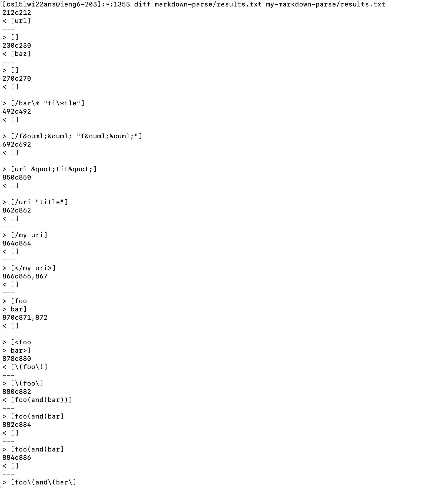

# **WEEK 10 LAB REPORT**

## **Finding the Diff**

Using the `diff` command, we can see the differences in the results of extracting the links out of the test files using the different implementations. The line numbers shown can also tell us where the difference are.

## **Difference 1**
One of the files that is causing two differing links has the following contents:
```
[Foo*bar\]]:my_(url) 'title (with parens)'

[Foo*bar\]]
```
The link is supposed to be `title (with parens)`. 

My Implementation ouput: `[]` <br>
Other Implementation: `[url]`

We will look into why my implementation was wrong. The reason for this is because my implementation only considers links that are in the form `[link](url)`. In other words, the bug is that my code does not consider other types of markdown link formatting. This one considered a different way of using links in the markdown file which is why this code will not be able to catch anything from this. We can fix this by adding a new `if` statement after `int nextCloseBracket = markdown.indexOf("]", nextOpenBracket);` this line in my code to see if it contains the `:my_(url)` afterwards so that it does not skip these cases in extracting the links in the markdown file.

## **Difference 2**
Another one of the files that is causing two differing links has the following contents:
```
[foo]: <bar>(baz)

[foo]
```

There should be no link so `[]` should be expected.

My Implementation output: `[]` <br>
Other Implementation: `[baz]`

We will look into my the other implementation was wrong. The bug is that this code does not take into consideration the cases were the file contains some other formatting strings such as `<bar>`. Because of the nature of this, the code ignores the this group of characters and instead thinks the string between the two parenthesis is the link, in this case `baz`. The change in code should happen before `int openParen = markdown.indexOf("(", nextCloseBracket);` this line in the getLinks method. They should add a `if` statement here to see if there are any characters in between the closed bracket index and the opening parenthesis index.